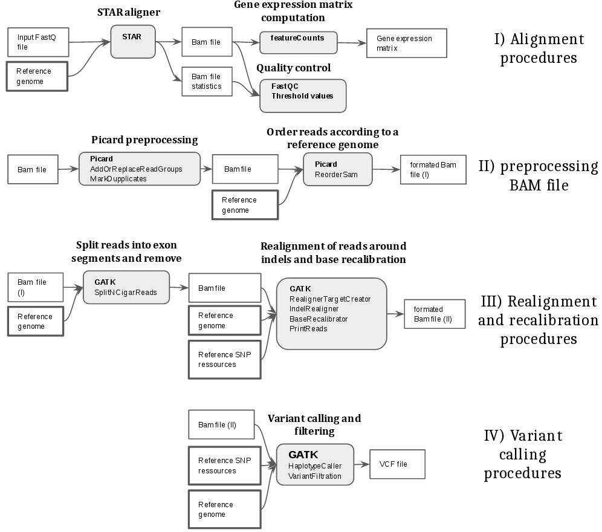

# SNV computation pipeline

This module aims to align reads from FASTQ files and infer SNVs from RNA-seq dataset. The pipeline is largely inspired from the [GATK variant calling good practices.](http://gatkforums.broadinstitute.org/wdl/discussion/3891/calling-variants-in-rnaseq). Also, it can optionally infer raw gene expression, annotate SNV and doing Quality Control (QC) check.

* GATK reference:
  * [From FastQ data to high confidence variant calls: the Genome Analysis Toolkit best practices pipeline.](http://www.ncbi.nlm.nih.gov/pubmed/25431634)

* Pipeline schema:
  


##


# STAR alignment and SNV calling from scratch using docker

## Requirements
* docker
* possible root access
* 13.8 GB of free memory (docker image) + memory for STAR indexes (usually 20 GB per index) and downloaded data

## installation (local)

```bash
docker pull opoirion/ssrge
mkdir /<Results data folder>/
cd /<Results data folder>/
PATHDATA=`pwd`
```

## usage

The pipeline consists of  4 steps for aligning and calling SNVs:

```bash
# align and SNV calling
docker run --rm opoirion/ssrge star_index -h
docker run --rm opoirion/ssrge process_star -h
docker run --rm opoirion/ssrge feature_counts -h
docker run --rm opoirion/ssrge process_snv -h

```

## example

Let's download and process 2 samples from GSE79457 in a project name test_n2

```bash
# download of the soft file containing the metadata for GSE79457 (see download section)
## all these data can also be obtained using other alternative workflows
# here you need to precise which read length to use for creating a STAR index and which ref organism (MOUSE/HUMAN)
docker run --rm -v $PATHDATA:/data/results/:Z opoirion/ssrge star_index -project_name test_n2 -read_length 100 -cell_type HUMAN
# STAR alignment
docker run --rm -v $PATHDATA:/data/results/:Z opoirion/ssrge process_star -project_name test_n2 -read_length 100 -cell_type HUMAN
# sample-> gene count matrix
docker run --rm -v $PATHDATA:/data/results/:Z opoirion/ssrge feature_counts -project_name test_n2
#SNV inference
docker run --rm -v $PATHDATA:/data/results/:Z opoirion/ssrge process_snv -project_name test_n2 -cell_type HUMAN
```

# Installation from github (*not updated!!* => Use the docker image for now)

## Requirements
* The pipeline requires that the following programs are installed:
    * Linux/ Unix (not tested) working environment
    * [python 2 (>=2.7)](https://www.python.org/download/releases/2.7.2/)
    * [STAR Aligner](https://github.com/alexdobin/STAR)
    * [GATK](https://software.broadinstitute.org/gatk/download/)
    * [picard-tools](https://broadinstitute.github.io/picard/)
    * [Java (>=1.8)](http://www.oracle.com/technetwork/java/javase/downloads/jdk8-downloads-2133151.html)
    * [FastQC](http://www.bioinformatics.babraham.ac.uk/projects/download.html#fastqc) \[OPTIONAL\]
    * [featureCounts](http://subread.sourceforge.net/) \[OPTIONAL\]
    * [snpEff](http://snpeff.sourceforge.net/) \[OPTIONAL\]
      * Appropriate snpEff database should be downloaded and installed (see config.py). (It can be done using snpEff command line, see documentation)

* For each sample, FASTQ files must be inside a specific folder. Also, all the FASTQ folders must be inside a specific folder. (see config.py file)
* reference genome (.fa file) and gene annotations file (.gtf) must be provided (see config.py file)
* Reference variant files must be also provided for the SNV calling procedure (see config.py file).
  * \[HUMAN\]:
    * dbsnp can be downloaded here: [ftp://ftp.ncbi.nih.gov/snp/organisms/](ftp://ftp.ncbi.nih.gov/snp/organisms/)
    * additional reference SNV resources can be downloaded here: [ftp://ftp.broadinstitute.org/bundle/2.8/hg19](ftp://ftp.broadinstitute.org/bundle/2.8/hg19)
  * \[MOUSE\]:
    * Mouse reference variant and indel databases can be downloaded here: [ftp://ftp-mouse.sanger.ac.uk/REL-1303- SNPs_Indels-GRCm38/](ftp://ftp-mouse.sanger.ac.uk/REL-1303- SNPs_Indels-GRCm38/). However, vcf files should probably be resorted toward the mouse reference genome using the sequence dictionnary.

## configuration

move to folder of the git project (https://github.com/lanagarmire/SSrGE.git)

```bash
cd SSrGE
```

All the environment variables should be set into the ./garmire_SNV_calling//config.py file

## usage

* Once all the environment variables are defined, one should run the test scripts:

* [optional] Running all the tests:
  *

```bash
  python test/test_snv.py -v
  python test/test_snv_optional.py -v # test optionnal features described above
  ```

* create a STAR index for the used reference genome and the read length used:

```bash
python garmire_SNV_calling/generate_STAR_genome_index.py
```

* Align the reads

```bash
python garmire_SNV_calling/deploy_star.py
```

* infer SNVs

```bash
python garmire_SNV_calling/process_multiple_snv.py
```

* Check STAR overall quality (generate a csv file with the percentage of unique reads mapped for each sample in OUTPUT_PATH)

```bash
python garmire_SNV_calling/check_star_overall_quality.py
```

* generate a fastqc report for each sample \[argument --nb_threads: number of processes in parallel\]

```bash
python garmire_SNV_calling/process_fastqc_report.py --nb_threads <int>
```

* Use the FastQC report to generate a csv file in OUTPUT_PATH reporting, for each sample, if the [duplicated test](http://www.bioinformatics.babraham.ac.uk/projects/fastqc/Help/3%20Analysis%20Modules/8%20Duplicate%20Sequences.html) of fastqc is passed.

```bash
python garmire_SNV_calling/check_fastqc_stats.py
```

* Generate gene expression matrices (raw count)

```bash
python garmire_SNV_calling/compute_frequency_matrix.py
```

* Annotate SNV: generate new .vcf files with SNV annotations. \[argument --nb_threads: number of processes in parallel\]

```bash
python garmire_SNV_calling/process_annotate_snv.py --nb_threads <int>
```

## contact and credentials
* Developer: Olivier Poirion (PhD)
* contact: opoirion@hawaii.edu